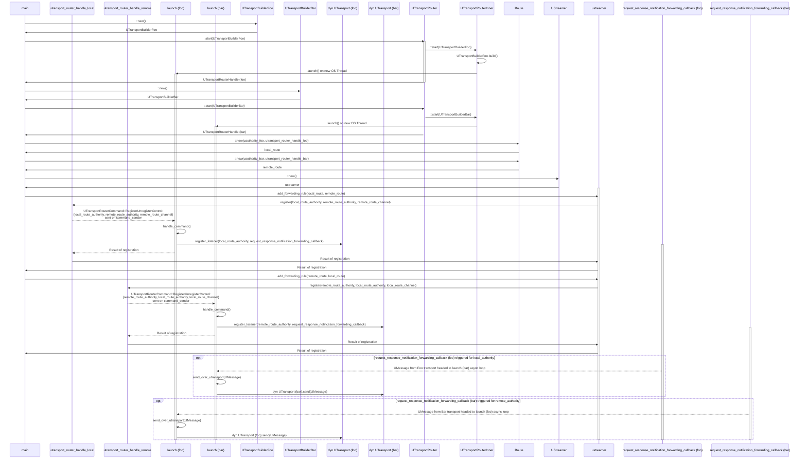

# up-streamer-rust

Generic, pluggable uStreamer that should be usable in most places we need
to bridge from one transport to another.

## Overview

Implementation of the uProtocol's uStreamer specification in Rust.

### Visual Breakdown



`UTransport` is not thread-safe, so we opt for an approach where a `UTransportRouter` starts a `UTransportRouterInner` which launches an OS thread onto which the `Box<dyn UTransport>` is built and we await further commands / messages in an async loop.

### Generating cargo docs locally

Documentation can be generated locally with:
```bash
cargo doc --package up-streamer --open
```
which will open your browser to view the docs.

## Getting Started

### Working with the library

`up-streamer-rust` is generic and pluggable and can serve your needs so long as
1. Each transport you want to bridge over has a `up-client-foo-rust` library
   and UPClientFoo struct which has `impl`ed `UTransport`
2. `UTransportBuilder` has been `impl`ed on a struct so that a 
   `Box<dyn UTransport>` can be safely created by the `UTransportRouter`
   in the proper thread's context

### Usage

After following along with the [cargo docs](#generating-cargo-docs-locally) generated to add all your forwarding routes, you'll then need to keep the instantiated `UStreamer`, `UTransportRouter`, and `UTransportRouterHandle` around and then pause the main thread, so it will not exit, while the routing happens in the background threads spun up.

## Implementation Status

- [x] Routing of Request, Response, and Notification Messages
- [ ] Routing of Publish messages (requires further development of uSubscription interface)
- [x] Mechanism to retrieve messages received on and sent over transports