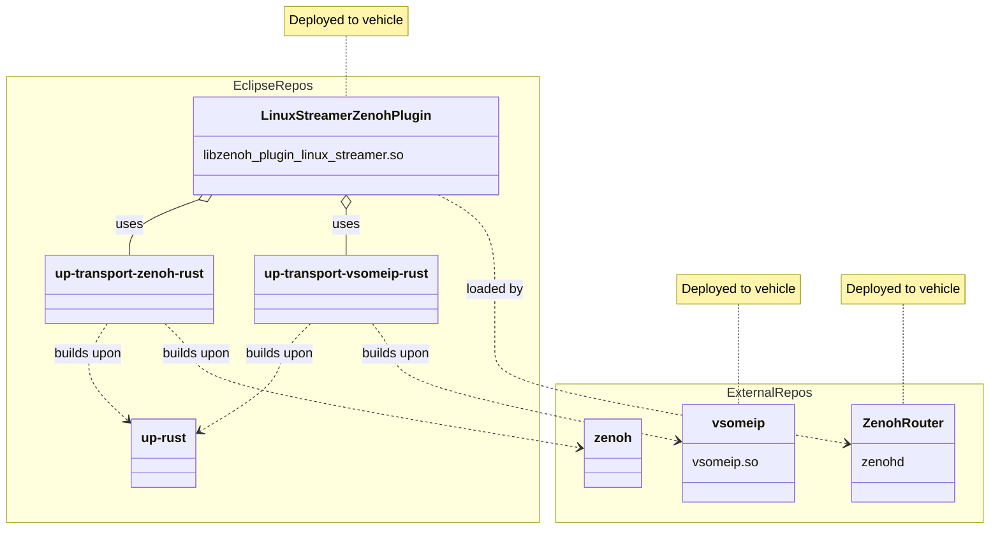

# up-linux-streamer-plugin

_Note_: Currently not usable. Must be updated to use tokio instead of async-std.

## The Concept



## Using the plugin

### Build the plugin

```bash
LD_LIBRARY_PATH=<path/to/where/to/install/vsomeip/lib> VSOMEIP_INSTALL_PATH=<path/to/where/to/install/vsomeip/lib> cargo build
```

### Bundled vsomeip or bring your own

The default is to build a bundled version of [vsomeip](https://github.com/COVESA/vsomeip) for use by the `up-transport-vsomeip` crate.

The vsomeip library is used to communicate over [SOME/IP](https://some-ip.com/) to mechatronics devices.

If you wish to bring your own vsomeip install, you can use the flag `--no-default-features` flag when building with `cargo build`. For more details on required environment variables when building `up-transport-vsomeip-rust`, reference the README for [vsomeip-sys](https://github.com/eclipse-uprotocol/up-transport-vsomeip-rust/tree/main/vsomeip-sys).

### Copy plugin and configs to standalone folder

```bash
mkdir -p my/new/standalone/zenohd/path
cp target/debug/libzenoh_plugin_up_linux_streamer.so my/new/standalone/zenohd/path/
cp up-linux-streamer-plugin/DEFAULT_CONFIG.json5 my/new/standalone/zenohd/path/
cp -r up-linux-streamer-plugin/vsomeip-configs my/new/standalone/zenohd/path/
```

### A note on compatability

Because up-transport-zenoh-rust uses minimum supported Rust version (**MSRV**) of 1.74.0 and up-rust uses MSRV of 1.72.1, we need to build Zenoh from source in order to get a compatible zenohd (Zenoh Router). The following steps describe how to do so.

Note: We have an open issue [here](https://github.com/eclipse-uprotocol/up-streamer-rust/issues/43) which is for creating a compatible Zenoh Router (zenohd) which will avoid the next section.

### Getting Zenoh

https:

```bash
git clone https://github.com/eclipse-zenoh/zenoh.git
```

ssh:

```bash
git clone git@github.com:eclipse-zenoh/zenoh.git
```

### Check out a compatible release tag

Currently this is:

```bash
git checkout release/0.11.0
```

You can `git checkout -b <my_relevant_tag>` here if you wish to save these changes to some fork for later usage.

### Modify MSRV of Zenoh

In zenoh/rust-toolchain.toml, modify to version `1.74.0`:

```toml
[toolchain]
channel = "1.74.0"
```

In zenoh/Cargo.toml, modify rust-version:

```toml
[workspace.package]
rust-version = "1.74.0"
```

### Make a build of Zenoh and copy to standalone folder

Within the Zenoh folder:

```bash
cargo build
```

```bash
cp target/debug/zenohd my/new/standalone/zenohd/path
```

### Running zenohd with up-linux-streamer-plugin

From within the `my/new/standalone/zenohd/path`:

```bash
RUST_LOG=trace LD_LIBRARY_PATH=<your/path/to/vsomeip/lib>  VSOMEIP_LIB_DIR=<your/path/to/vsomeip/lib> ./zenohd --config DEFAULT_CONFIG.json5
```

You can also run without the `RUST_LOG=trace` environment variable prepended and should for production use cases. It can be used for debugging purposes.

### You're done!

## Supported Use Cases

### RPC

* `uE_client` <-> `mE_service`
* `mE_client` <-> `uE_service`

### PubSub

* `uE_publisher` -> `mE_subscriber`
* `mE_publisher` -> `uE_subscriber`

## Running the examples

You are able to run example applications of the names listed above like so from within this repo in one terminal:

```bash
RUST_LOG=trace LD_LIBRARY_PATH=<your/path/to/vsomeip/lib> VSOMEIP_LIB_DIR=<your/path/to/vsomeip/lib> cargo run --example mE_client
```

and then in another terminal, again, within this repo:

```bash
RUST_LOG=trace cargo run --example uE_service
```

You should then see messages coming through in the terminal which you ran mE_client:

> Here we received response: HelloResponse { message: "The response to the request: me_client@i=3", special_fields: SpecialFields { unknown_fields: UnknownFields { fields: None }, cached_size: CachedSize { size: 0 } } }

You may also run the other examples similarly.

## Configuring the plugin

### up-linux-streamer-plugin configuration

A configuration file is required to be supplied to `zenohd` as shown in the [Using the plugin](#using-the-plugin) section.

`DEFAULT_CONFIG.json5` is provided as a starting point, but can have certain parameters modified. Please reference it for guidance.

### Host device presentation to mechatronics

A configuration file is required to hold the ue_ids of all uEntities present on the host device which will communicate with the mechatronics network.

`DEFAULT_CONFIG.json5` has guidance on these configurations as well.
