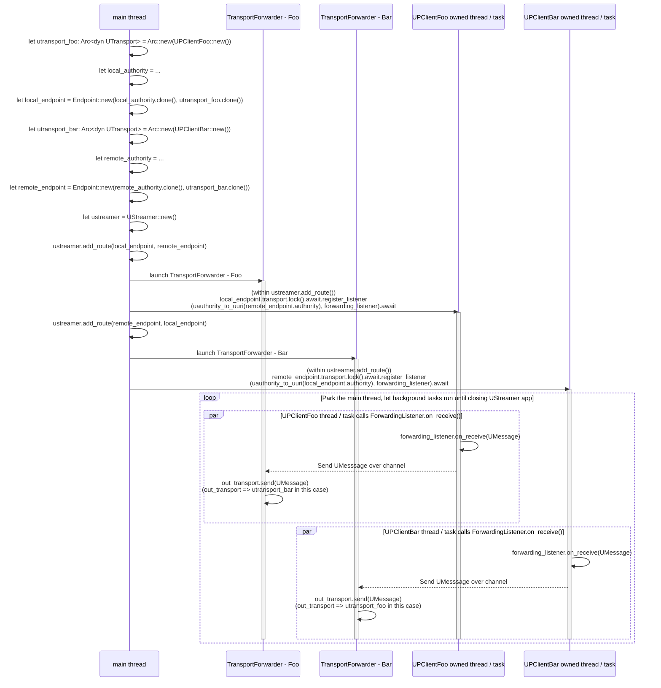

# up-streamer

Generic, pluggable uStreamer that should be usable in most places we need
to bridge from one transport to another.


## Overview

Implementation of the uProtocol's uStreamer specification in Rust.

### Visual Breakdown



### Generating cargo docs locally

Documentation can be generated locally with:

```bash
cargo doc --package up-streamer --open
```

which will open your browser to view the docs.

## Getting Started

### Working with the library

`up-streamer-rust` is generic and pluggable and can serve your needs so long as
* Each transport you want to bridge over has a `up-transport-foo-rust` library
  and UPTransportFoo struct which has `impl`ed `UTransport`

### Usage

After following along with the [cargo docs](#generating-cargo-docs-locally) generated to add all your forwarding rules, you'll then need to keep the instantiated `UStreamer` around and then pause the main thread, so it will not exit, while the routing happens in the background threads spun up.

## Implementation Status

- [x] Routing of Request, Response, and Notification Messages
- [ ] Routing of Publish messages (requires further development of uSubscription interface)
- [x] Mechanism to retrieve messages received on and sent over transports

## Benchmark Guardrails

`up-streamer` uses a pinned Criterion harness (`criterion = 0.5.1`) at:

- `up-streamer/benches/streamer_criterion.rs`

The helper script runs canonical benchmark commands and can invoke the Rust guardrail CLI:

```bash
export CRITERION_ARGS="--sample-size 60 --warm-up-time 3 --measurement-time 12 --noise-threshold 0.02"
if command -v taskset >/dev/null; then export BENCH_PIN_PREFIX="taskset -c 2"; else export BENCH_PIN_PREFIX=""; fi

scripts/bench_streamer_criterion.sh baseline
scripts/bench_streamer_criterion.sh candidate ergonomics_candidate_slice_a
scripts/bench_streamer_criterion.sh guardrail ergonomics_candidate_slice_a "$OPENCODE_CONFIG_DIR/reports/ergonomics-perf/bench-data/criterion-guardrail.json"
scripts/bench_streamer_criterion.sh export
```

Threshold pass/fail evaluation is handled only by the Rust CLI:

```bash
cargo run -p criterion-guardrail -- \
  --criterion-root target/criterion \
  --baseline ergonomics_baseline \
  --candidate ergonomics_candidate_slice_a \
  --throughput-threshold-pct 3 \
  --latency-threshold-pct 5 \
  --alloc-proxy-threshold-pct 5 \
  --report "$OPENCODE_CONFIG_DIR/reports/ergonomics-perf/bench-data/criterion-guardrail.json"
```
